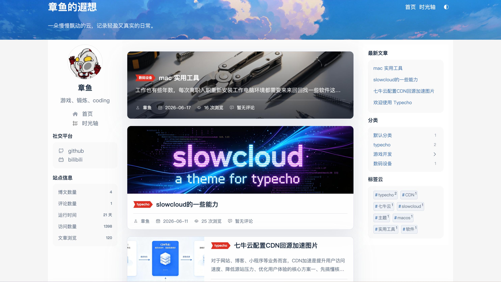
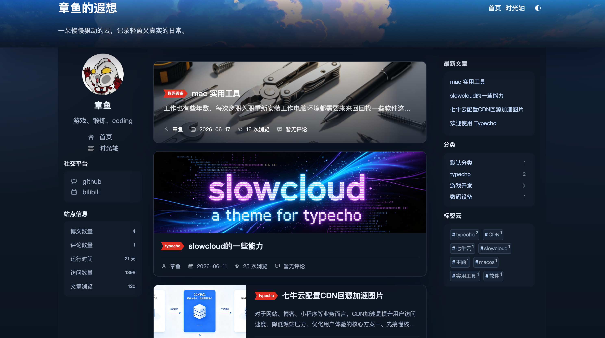

# Slowcloud

<p align="right">
  <a href="./README.md">中文</a> · <strong>English</strong>
</p>

Slowcloud is a lightweight Typecho theme with a calm and airy visual style. It is designed for personal blogs, journals, and article-focused sites.

Demo site: [https://slowcloud.cn](https://slowcloud.cn)

<p align="center">
  
</p>
<p align="center">
  
</p>

## Requirements

- Developed and tested with Typecho `1.3.0`.
- PHP `8.0` or later is recommended. PHP `7.4` or later is the suggested minimum.
- Make sure the PHP extensions required by Typecho are available, including `mbstring`, `json`, `Reflection`, and at least one database extension such as `mysqli`, `sqlite3`, `pgsql`, or the corresponding PDO extension.
- Older Typecho or PHP versions may require manual adaptation for theme settings, admin editor enhancements, and modern PHP type declarations.

## Features

### V1.0.1

- Enhanced SEO fields for individual posts, including SEO title, SEO description, canonical URL, and noindex.
- Automatic output for description, robots, Open Graph, Twitter Card, and JSON-LD structured data.
- Added Sitemap and Robots support. The theme can respond to `sitemap.xml` and `robots.txt`, and the sitemap includes the home page, posts, pages, and post poster image data.
- Improved visit statistics. The theme can record PV, UV, IP, and recent visits by itself, while the `SlowcloudStatistics` plugin mainly provides the admin statistics panel.
- More precise statistics filtering, excluding logged-in administrators, HEAD requests, non-HTML requests, prefetch requests, and common crawler user agents. Excluded visits can still appear in recent visits, but they do not increase PV, UV, or post views.
- Added a post TOC switch, disabled by default. Added poster alt text and three post list styles for posts with posters: standard poster, horizontal media, and immersive cover.
- Article content images and post poster images can be enlarged on click. Internal navigation shows a top loading bar that automatically moves below the header when the header is visible.
- Added custom entry and social platform configuration. Multiple links can be configured in the admin panel with a name, SVG icon, and target URL.
- Improved tag cloud and post tag display with `#` prefixes and tag counts. Code blocks now include a copy button.
- Added version query strings for theme assets, and improved editor preview, TOC preview, code block insertion, and draft custom-field saving.

### V1.0.0

- Templates for home, archives, search results, single posts, standalone pages, 404, and timeline pages.
- Responsive three-column layout with optional sidebar visibility.
- Customizable header logo, background image, height, site width, and intro text.
- Author panel with avatar, name, bio, GitHub link, Bilibili link, friend links, and site statistics.
- Sidebar widgets for recent posts, categories, and tag cloud.
- Post poster field for post cards, post detail pages, and timeline entries.
- Post view counting and display.
- Timeline page grouped by year and month, with total posts, month count, latest update, and earliest post.
- Light, dark, and system-based default theme modes, with a frontend toggle.
- Grouped theme options in the Typecho admin panel.
- Markdown content styling for headings, tables, blockquotes, inline code, and more.
- Enhanced Markdown editor in the Typecho admin area.
- Prism code highlighting with Coy in light mode and Okaidia in dark mode.
- Prism autoloader and line numbers for both frontend content and editor preview.
- macOS-like code block window rendering.
- Comment form with replies, avatars, emoji picker, and emoji shortcode rendering.
- Emoji groups for Paopao, Aru, kaomoji, and Unicode emoji.
- CDN URL rewriting for `usr/uploads` images and slowcloud emoji images.
- ICP and public security registration links in the footer.

## Installation

1. Put the `slowcloud` directory into Typecho's `usr/themes/` directory.
2. Go to `Dashboard -> Appearance` in Typecho and activate `slowcloud`.
3. Open the theme settings and configure the logo, header background, author profile, links, theme mode, and CDN URL as needed.

## Common Settings

- `Browser Tab Text`: browser title suffix. Falls back to the site title when empty.
- `Site Logo`: used for favicon and header identity.
- `Header Background Image`: top header banner image.
- `Header Height`: accepts CSS values such as `120px` or `80vh`.
- `Site Width`: controls the main content width.
- `Main Background`, `Left Column Background`, `Center Column Background`, `Right Column Background`: page area background controls.
- `Home Intro`: displayed in the header and used as fallback author copy.
- `Author Avatar`, `Author Name`, `Author Bio`: content for the author panel.
- `GitHub URL`, `Bilibili URL`: social links in the author panel.
- `Friend Links`: one link per line, using `Name|https://example.com`.
- `Sidebar`: show or hide the right sidebar.
- `Default Theme Mode`: light, dark, or system.
- `Upload Image CDN URL`: CDN root such as `https://cdn.example.com`. It rewrites upload images and emoji image URLs.
- `ICP Registration`, `Public Security Registration`: footer registration information.

## File And Directory Guide

```txt
slowcloud/
	├── index.php                 # Home, archive, search, and list page entry
	├── archive.php               # Archive entry that reuses index.php
	├── post.php                  # Single post template with views, poster image, content, tags, previous/next links, and comments
	├── page.php                  # Standalone page template
	├── timeline.php              # Custom timeline page template
	├── comments.php              # Comment list, comment form, and emoji picker
	├── header.php                # Page head, navigation, theme styles, and Prism styles
	├── footer.php                # Footer, registration links, frontend scripts, and Prism scripts
	├── 404.php                   # 404 page with search form
	├── functions.php             # Theme settings, utilities, content rendering, CDN rewriting, emoji parsing, view counting, timeline data, and editor integration
	├── style.css                 # Typecho theme declaration file
	├── screenshot.png            # Theme screenshot shown in the Typecho admin panel
	├── README.md                 # Chinese documentation
	├── README.en.md              # English documentation
	├── components/               # Reusable page components
	│	├── author-panel.php       # Author panel with avatar, bio, social links, site stats, and friend links
	│	├── sidebar.php            # Right sidebar with recent posts, categories, and tag cloud
	│	├── post-card.php          # Post card for list pages
	│	├── pagination.php         # Pagination component
	│	├── empty.php              # Empty state component
	│	└── post-meta.php          # Post metadata component
	└── assets/                   # Static assets
		├── css/                  # Stylesheets
		│	├── main.css           # Main theme styles for layout, header, cards, sidebar, comments, emoji picker, responsive rules, and light/dark themes
		│	├── content-render.css # Markdown content styles for posts and editor preview
		│	└── code-highlight.css # Prism code window, line numbers, and light/dark code styles
		├── js/                   # Frontend scripts
		│	├── main.js            # Theme switching, category toggling, emoji insertion, and comment reply state
		│	└── code-highlight.js  # Frontend code highlighting, language detection, Prism autoloading, and code window wrapping
		├── typecho/              # Typecho admin enhancement assets
		│	├── editor-enhance.js  # Enhanced Markdown editor behavior in the Typecho admin area
		│	├── editor-enhance.css # Admin editor and preview styles
		│	└── prism/             # Local Prism runtime, language components, autoloader plugin, line-numbers plugin, and Coy/Okaidia themes
		├── json/                 # JSON configuration assets
		│	└── slowcloud.owo.json # Paopao, Aru, and kaomoji emoji configuration
		├── owo/                  # Emoji image assets
		│	├── paopao/            # Paopao emoji images
		│	└── aru/               # Aru emoji images
		├── iconfont/             # Icon font assets used by buttons and metadata icons
		└── img/                  # Default images, including avatar, logo, header backgrounds, and post placeholders
```

## Notes

- To use the timeline, create a standalone page and select the `Timeline Page` template.
- To view PV, UV, IP, and recent visit records in the admin area, enable the `SlowcloudStatistics` plugin and open the `Slowcloud Statistics` panel.

## Acknowledgements

Slowcloud was inspired by the implementation ideas and design details of these excellent Typecho themes:

- [Joe](https://github.com/HaoOuBa/Joe)
- [Kratos](https://github.com/chengzhi233/Kratos)
- [Handsome](https://www.ihewro.com/archives/489/)

## License

Slowcloud is released under the [MIT License](LICENSE).
